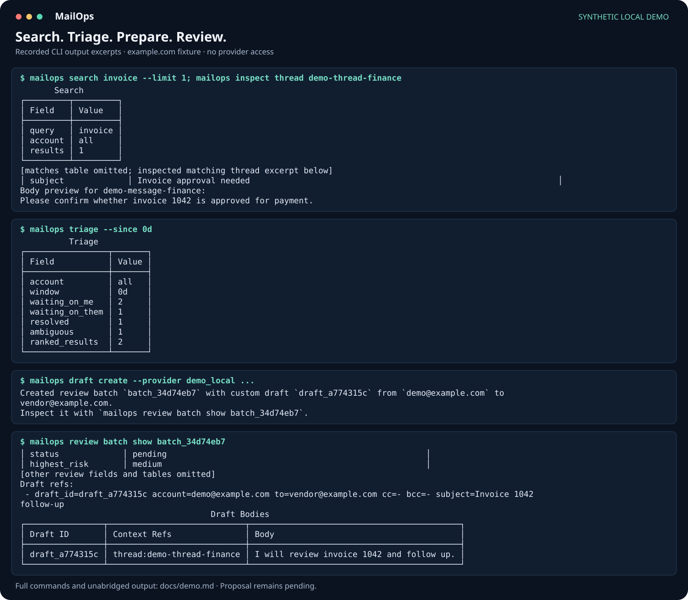

# Try MailOps with a synthetic mailbox

This walkthrough uses the built-in `example.com` fixture: five threads and six
messages. It exercises local search, inspection, triage, draft preparation, and
review. It does not connect to Proton Bridge or contact any provider.



The image contains excerpts of actual CLI output, arranged in labelled terminal
panels. Omitted tables and rows are identified in the image, and the
search excerpt includes inspection of the matching thread. All output is preserved in the
[complete recorded transcript](assets/workflow-demo.txt), with trailing line padding
trimmed. This is a synthetic
demonstration, not a screenshot of an operator's mailbox. Dates and generated
proposal identifiers vary each time it runs.

## Run the complete demonstration

After the [installation steps](../README.md#install-the-release), run the complete
block for your shell. It creates new temporary state and restores your previous
`MAILOPS_HOME` setting when finished. The explicit `demo_local` provider keeps
the proposal associated with the fixture account.

### PowerShell

```powershell
$previousMailopsHome = $env:MAILOPS_HOME
try {
    $env:MAILOPS_HOME = Join-Path ([System.IO.Path]::GetTempPath()) ("mailops-demo-" + [guid]::NewGuid())
    mailops demo seed
    mailops status
    mailops search invoice --limit 1
    mailops inspect thread demo-thread-finance
    mailops triage --since 0d
    $draftOutput = mailops draft create --provider demo_local --from-account demo@example.com --to vendor@example.com --subject "Invoice 1042 follow-up" --body "I will review invoice 1042 and follow up." --context-ref thread:demo-thread-finance
    $draftOutput
    $batchMatch = [regex]::Match(($draftOutput -join "`n"), 'Created review batch `(batch_[a-z0-9]+)`')
    if (-not $batchMatch.Success) { throw "Draft creation did not return a batch ID." }
    mailops review batch show $batchMatch.Groups[1].Value
} finally {
    $env:MAILOPS_HOME = $previousMailopsHome
}
```

### Bash or zsh

```bash
(
    export MAILOPS_HOME="$(mktemp -d -t mailops-demo.XXXXXXXX)"
    mailops demo seed
    mailops status
    mailops search invoice --limit 1
    mailops inspect thread demo-thread-finance
    mailops triage --since 0d
    draft_output=$(mailops draft create --provider demo_local --from-account demo@example.com --to vendor@example.com --subject "Invoice 1042 follow-up" --body "I will review invoice 1042 and follow up." --context-ref thread:demo-thread-finance)
    printf '%s\n' "$draft_output"
    batch_id=$(printf '%s\n' "$draft_output" | sed -n 's/.*Created review batch `\(batch_[a-z0-9]*\)`.*/\1/p')
    test -n "$batch_id" && mailops review batch show "$batch_id"
)
```

Expected results: the invoice search finds one message; triage reports two
threads waiting on you, one waiting on someone else, one resolved, and one
ambiguous. The custom draft is addressed to `vendor@example.com` and remains
pending with medium risk. Review displays the proposed recipients, body, and
context reference. No `apply` step is part of this demo.

`--since 0d` includes all fixture dates. The temporary demo directory contains
synthetic local state only; you can remove that directory when finished.

## Regenerate the published recording

From a source checkout with MailOps installed in a virtual environment:

```text
python scripts/render_demo.py
```

The script uses the current interpreter and repository source, strips inherited
`MAILOPS_*` settings, and creates a unique temporary working directory and
`MAILOPS_HOME`. It runs the commands above, obtains the batch ID from actual draft
creation output, saves the full transcript and selected-output SVG under
`docs/assets/`, and removes the temporary state on exit. It uses only Python's
standard library and the existing MailOps dependencies. There is no network or
provider command in the recording sequence.
